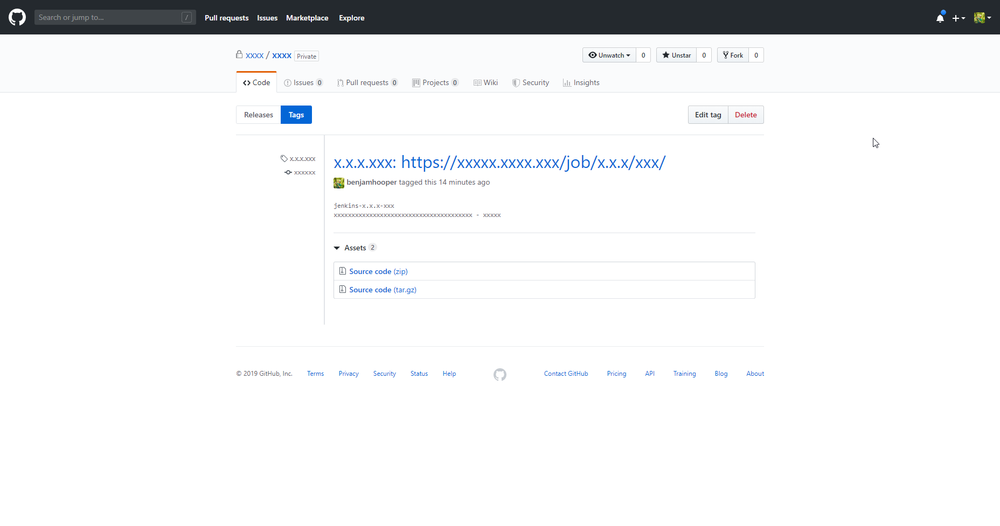

# Jenkins Environment Variables
Searching for Jenkins Environment Variables are you can find them at xxx.xxx/env-vars.html/

My most common use cases: 
- `$BUILD_ID`
- `$GIT_URL`
- `$BUILD_URL`
- `$BUILD_TAG`
- `$GIT_COMMIT`
- `$JOB_NAME.$BUILD_NUMBER`

Here is an example of jenkins and github release/tags with notes using environment variables.

