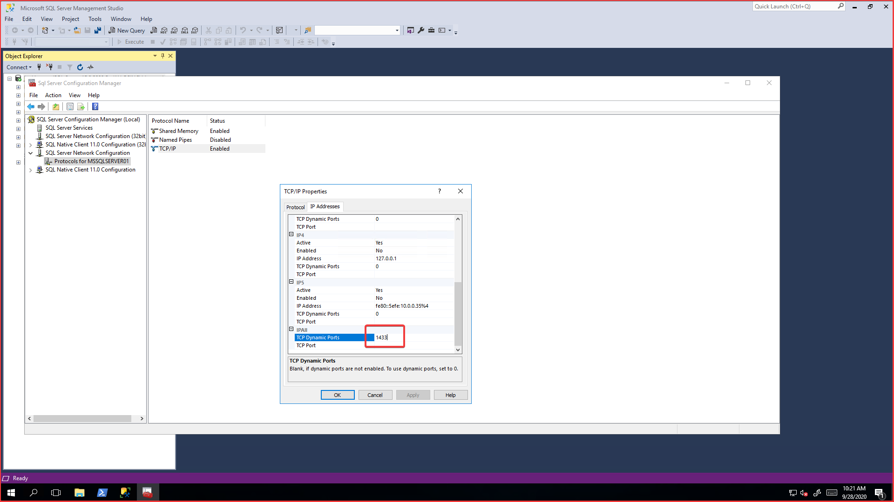
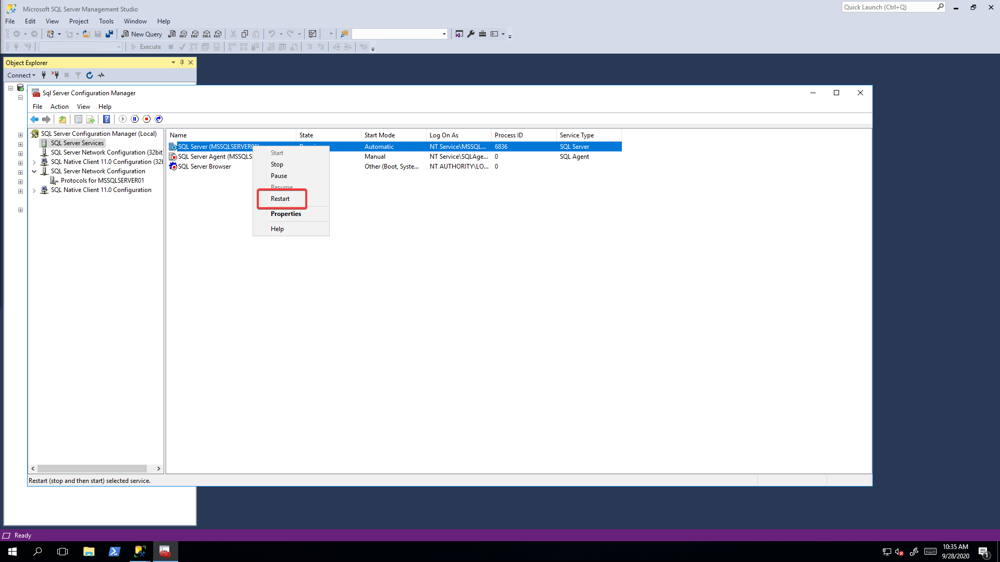

# SQL Instance Name

I had a case where I needed to upgrade SQL Servers. Installed SQL 2019 side by side with SQL 2017. I then transferred all my dbs from 2017 to 2019. Though I couldn't reach it at localhost anymore like I did with 2017 instance. Instead I had to connect with servername\MSSQLSERVER01.

To fix this you'll have to change ports within the configuration of SQL Server. I'm using the developer edition.

You'll need to change the port number below to `1433`

To apply these changes you'll need to restart the SQL instance to reach localhost/hostname.

